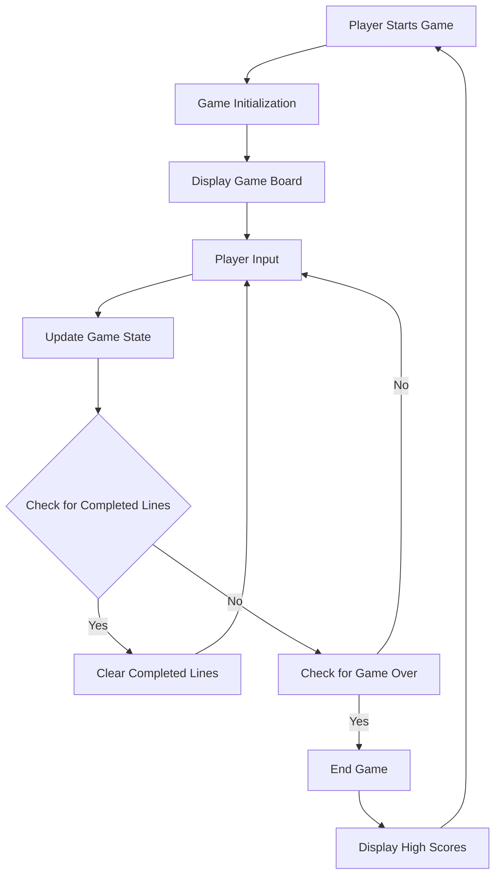
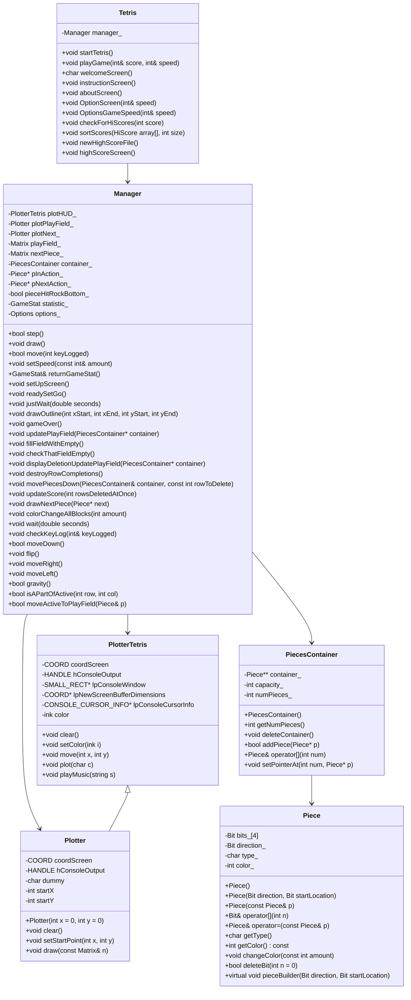

# CommandLine Tetris

CommandLine Tetris is a console-based version of the classic Tetris game. This implementation includes various features such as different game speeds, high score tracking, and customizable game options.

## Table of Contents
- [Features](#features)
- [Installation](#installation)
- [Usage](#usage)
- [File Structure](#file-structure)
- [Contributing](#contributing)
- [License](#license)

## Features
- Play the classic Tetris game in your command line.
- Track high scores and save them to a file.
- Customize game speed and other options.
- Enjoy retro console graphics and sounds.

## Installation

Currently, this code requires Windows (calls `windows.h`).

To compile and run CommandLine Tetris, follow these steps:

1. Clone the repository:
    ```bash
    git clone https://github.com/ryoung/CommandLine_Tetris.git
    cd CommandLine_Tetris
    ```

2. Ensure you have a C++ compiler installed (such as g++ or clang).

3. Compile the project:
    ```bash
    g++ -o tetris main.cpp Tetris.cpp Manager.cpp hiscorestuff.cpp SpeedSettings.cpp Plotter.cpp
    ```

4. Run the game:
    ```bash
    ./tetris
    ```

## Usage
After running the game, you will be presented with a welcome screen. Use the following controls to play the game:

- **Arrow Keys**: Move the pieces left, right, or down.
- **Up Arrow**: Rotate the pieces.
- **Spacebar**: Instantly drop the piece.
- **Menu Options**:
  - **1**: Play Game
  - **2**: Options
  - **3**: Instructions
  - **4**: High Scores
  - **5**: About
  - **6**: Exit

## File Structure

- **main.cpp**: Entry point of the application.
- **Tetris.h / Tetris.cpp**: Main game logic and user interface management.
- **Manager.h / Manager.cpp**: Manages the game state and gameplay mechanics.
- **hiscorestuff.h / hiscorestuff.cpp**: Handles high score checking and file operations.
- **Plotter.h / Plotter.cpp**: Manages the console graphics and rendering.
- **PiecesContainer.h / Pieces.h / Pieces.cpp**: Manages the Tetris pieces and their behaviors.
- **SpeedSettings.h / SpeedSettings.cpp**: Manages game speed settings and adjustments.
- **HeaderStuff.h**: Contains various constants and struct definitions used throughout the game.

## Algorithm overview



## Class Diagram



## Contributing
Contributions are welcome! If you find a bug or have a feature request, please open an issue. Feel free to fork the repository and submit pull requests.

1. Fork the repository.
2. Create a new branch:
    ```bash
    git checkout -b feature-branch
    ```
3. Make your changes.
4. Commit your changes:
    ```bash
    git commit -m 'Add some feature'
    ```
5. Push to the branch:
    ```bash
    git push origin feature-branch
    ```
6. Open a pull request.


